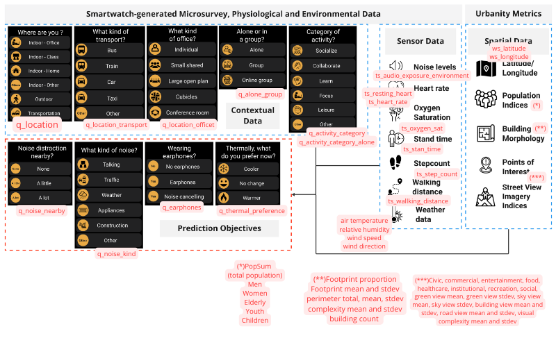

```{r setup, include=FALSE} 
knitr::opts_chunk$set(warning = FALSE, message = FALSE) 

```

## Competition

This competition's goal is to use contextual data to predict noise distraction and thermal preference across a diversity of indoor and outdoor spaces.

This competition includes the city-scale collection of 9,808 smartwatch-driven micro-survey responses that were collected alongside 2,659,764 physiological and environmental measurements from 98 people using the open-source Cozie-Apple platform combined with geolocation-driven urban digital twin metrics.

# Data

The data is available here https://www.kaggle.com/competitions/cool-quiet-city-competition/data

The dataset includes micro-survey responses from 98 people, who each provided at least 100 micro-survey responses from October 2022 to August 2023.

The data collection process for this competition utilized the open-source Cozie Apple platform. This mobile and smartwatch application for iOS devices allows people to complete a watch-based micro-survey and provide real-time feedback about environmental conditions via their Apple Watch. It leverages the built-in sensors of the smartwatch to collect physiological (e.g., heart rate, activity), environmental (sound level), and location (latitude and longitude) data.

The goal of the competition is to predict the values of the columns q_noise_nearby, q_noise_kind, q_earphones, q_thermal_preferenceas well as possible.

# Accuracy

The evaluation metric for this competition is accuracy. The metric is calculated as
$$\frac{TP+TN}{TP+TN+FP+FN}$$
As we have four targets here (q_noise_nearby, q_noise_kind, q_earphones, q_thermal_preference), accuracy for each target column is calculated and the average of the four of them is returned.

# Prediction

For each id_unique in the test set, you must predict the target variables: q_noise_nearby, q_noise_kind, q_earphones, q_thermal_preference.

# Dataset description

The physiological and environmental data were collected at a higher frequency than micro-survey responses. Therefore, these datasets are sparse, i.e., many values are empty as not every row contains a microsurvey response.



The spatial indicators (calculated using the URBANITY PYTHON PACKAGE starting from latitude and longitude) are grouped into 
Building Morphology and Point of Interest. 
For more information on the spatial indicators, please refer to Table 1 of Yap, W., Biljecki, F. A Global Feature-Rich Network Dataset 
of Cities and Dashboard for Comprehensive Urban Analyses. Sci Data 10, 667 (2023).

Urbanity is a network-based Python package to automate the construction of feature rich (contextual and semantic) urban networks at any geographical scale. Through an accessible and simple to use interface, users can request heterogeneous urban information such as street view imagery, building morphology, population (including sub-group), and points of interest for target areas of interest.


```{r}
# Load packages
library(scales)
library(dplyr)
library(tidyr)
library(tidyverse)
library(ggplot2)
library(ggpubr)
library(lubridate)
```


# Feature engineering

The features have different last dates

```{r}
load("cleaned_data.Rdata")

# Time ranges
as.Date(range(cozie_train$time))
as.Date(range(air_temp$time))
as.Date(range(RH$time))
as.Date(range(wind_dir$time))
as.Date(range(wind_speed$time))
as.Date(range(rainfall$time))
```


Let us have a look at the feature sparsity per the microsurvey variables
```{r}
df1=cozie_train[1:1000,]
df1$time=strptime(df1$time, 
                   format="%Y-%m-%d  %H:%M",
                   tz="Asia/Singapore")
df2=air_temp[1:1000,]
df2$time=strptime(df2$time, 
                   format="%Y-%m-%d  %H:%M",
                   tz="Asia/Singapore")
#df1=cozie_train[1:1000,]%>%format(time,format='%y-%m-%d %H:%M',tz='UTC')
#df2=air_temp[1:1000,]%>%format(time,format='%y-%m-%d %H:%M',tz="Asia/Singapore")

df_merge=merge(df1,df2,by="time",all=T)

head(df_merge[c("q_thermal_preference","S43")],500)

```

We compare it with environmental variables
```{r}
#merge()
```


```{r}
# How many available obs?
length(which(cozie_train$q_thermal_preference!=""))

# Create  no-sparse version
cozie_train_nosparse=cozie_train[which(cozie_train$q_thermal_preference!=""),]
dim(cozie_train_nosparse)
head(cozie_train_nosparse)
```

## Distribution of the microsurvey target variables
```{r}
attach(cozie_train_nosparse)
P1=ggplot(cozie_train_nosparse, aes(x=q_thermal_preference )) +
   #ggplot(data=tips, aes(x=day)) + 
      geom_bar(aes(y = (..count..)/sum(..count..)),
               fill=rainbow(length(unique(q_thermal_preference))))+
  labs(y="Freq",x="q_thermal_preferences")+
  theme(axis.text=element_text(size=5))

P2=ggplot(cozie_train_nosparse, aes(x=q_noise_nearby )) +
   #ggplot(data=tips, aes(x=day)) + 
      geom_bar(aes(y = (..count..)/sum(..count..)),
               fill=rainbow(length(unique(q_noise_nearby))))+
  labs(y="Freq",x="q_noise_nearby")+
  theme(axis.text=element_text(size=5))

P3=ggplot(cozie_train_nosparse, aes(x=q_earphones )) +
   #ggplot(data=tips, aes(x=day)) + 
      geom_bar(aes(y = (..count..)/sum(..count..)),
               fill=rainbow(length(unique(q_earphones))))+
  labs(y="Freq",x="q_earphones")+
  theme(axis.text=element_text(size=5))

P4=ggplot(cozie_train_nosparse, aes(x=q_noise_kind )) +
   #ggplot(data=tips, aes(x=day)) + 
      geom_bar(aes(y = (..count..)/sum(..count..)),
               fill=rainbow(length(unique(q_noise_kind))))+
  labs(y="Freq",x="q_noise_kind")+
  theme(axis.text=element_text(size=5))

detach(cozie_train_nosparse)
ggarrange(P1,P2,P3,P4,nrow=2,ncol=2)

```

## Distribution of the environmental variables for a given site

The environmental features have different levels of sparsity for a given site.

```{r}
plot_onesite=function(x1=air_temp,x2=rainfall,x3=RH,x4=wind_dir,x5=wind_speed,
                      site="S24"){
  
  P_x1=ggplot(data=x1,aes(x=time,y=x1[[site]]))+
    geom_line(linewidth=.65,color="#9999CC")+
    labs(y="Air temperature",x="Time", title=site)+
    theme_bw()+
    scale_x_datetime(labels = date_format("%y-%m-%d"))+
    theme(axis.text=element_text(size=6),
        axis.title=element_text(size=6,face="bold"))
  
  P_x2=ggplot(data=x2,aes(x=time,y=x2[[site]]))+
    geom_line(linewidth=.65,color="#9999CC")+
    labs(y="Rainfall",x="Time")+
    theme_bw()+
    scale_x_datetime(labels = date_format("%y-%m-%d"))+
    theme(axis.text=element_text(size=6),
        axis.title=element_text(size=6,face="bold"))
  
  P_x3=ggplot(data=x3,aes(x=time,y=x3[[site]]))+
    geom_line(linewidth=.65,color="#9999CC")+
    labs(y="Relative humidity",x="Time")+
    theme_bw()+
    scale_x_datetime(labels = date_format("%y-%m-%d"))+
    theme(axis.text=element_text(size=6),
        axis.title=element_text(size=6,face="bold"))
  
  P_x4=ggplot(data=x4,aes(x=time,y=x4[[site]]))+
    geom_line(linewidth=.65,color="#9999CC")+
    labs(y="Wind direction",x="Time")+
    theme_bw()+
    scale_x_datetime(labels = date_format("%y-%m-%d"))+
    theme(axis.text=element_text(size=6),
        axis.title=element_text(size=6,face="bold"))
  
  P_x5=ggplot(data=x5,aes(x=time,y=x5[[site]]))+
    geom_line(linewidth=.65,color="#9999CC")+
    labs(y="Wind speed",x="Time")+
    theme_bw()+
    scale_x_datetime(labels = date_format("%y-%m-%d"))+
    theme(axis.text=element_text(size=6),
        axis.title=element_text(size=6,face="bold"))
  
  all_P=ggarrange(P_x1, P_x2,P_x3,P_x4,P_x5,
                  nrow = 5,heights = c(1.5,1.5,1,1,1))
  return(all_P)
}


plot_onesite(site="S24")
```

## Distribution of one environmental variable for different sites

For a given feature, the level of sparsity differ for different sites.

```{r}
P_s24_RH=ggplot(data=RH,aes(x=time,y=S24))+
  geom_line(linewidth=.65,color="#9999CC")+
  labs(y="RH - S24",x="Time",title="Relative Humidity")+
  theme_bw()+
  scale_x_datetime(labels = date_format("%y-%m-%d"))
P_s102_RH=ggplot(data=RH,aes(x=time,y=S102))+
  geom_line(linewidth=.65,color="#9999CC")+
  labs(y="RH - S102",x="Time")+
  theme_bw()+
  scale_x_datetime(labels = date_format("%y-%m-%d"))
P_s116_RH=ggplot(data=RH,aes(x=time,y=S116))+
  geom_line(linewidth=.65,color="#9999CC")+
  labs(y="RH - S116",x="Time")+
  theme_bw()+
  scale_x_datetime(labels = date_format("%y-%m-%d"))

ggarrange(P_s24_RH, P_s102_RH,P_s116_RH,
          nrow = 3)
```

## Workflow

For our purposes, we need to construct a dataset containing a first column (some initial columns) with observation for the target feature(s) and, subsequently, all features we believe relevant for prediction (we call these explanatory features).

Regarding the cozie dataset, the target features are sparse, so we need to drop all NAs. Then, we need to parse the remaining observations with the "temporally closest" value of all explanatory features, or summary statistics of them computed based on most "recent" values. 

Considering the varying levels of sparsity across datasets, we follow these steps:

1) Conduct spatio-temporal interpolation of environmental variables to populate empty cells for each time-step, for the entire spatial grid.
2) Synthesize this data by computing averages to align with the micro-survey datasets' dimensions. (Hint: we might average environmental observations (through EMAs) between two micro-survey observations).
3) Temporally match these new features with target variables, result: a complete dataset.
4) Train a machine learning algorithm and subsequently conduct accuracy tests.


