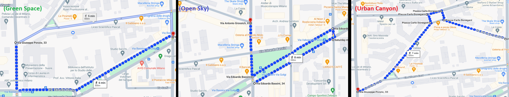
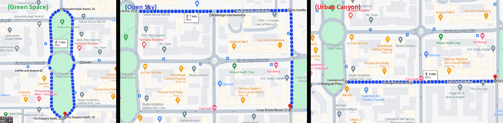

```{r setup, include=FALSE} 
knitr::opts_chunk$set(warning = FALSE, message = FALSE) 
```

```{r}
library(geojsonio)
library(leaflet)
library(leaflet.extras)
library(dplyr)
library(lubridate)
library(htmltools)
```


## GSV2SVF

GSV2SVF is designed to interactively calculate sky/tree/building view factors from Google Street View (GSV) panoramas in Google Maps. 

## Data

We consider data only for the sky and green view factors (SVF, GVF). We restrict our attention to the area of Città Studi.

## Summary statistics of SVF and GVF

```{r}
df=read.csv("Milano-CittaStudi2.csv")
df$date=ym(df$date)
#str(df)
summary(df[,c("svf","tvf")])
```

## Histograms of SVF and GVF

```{r}
par(mfrow=c(1,2))
hist(df$svf,main="SVF",ylab=" ",xlab=" ",breaks=20)
hist(df$tvf,main="GVF",ylab=" ",xlab=" ",breaks=20)
```


## Spatial distribution 

Here, we present the spatial distribution of sampled points. Click on any point to view its latitude, longitude, SVF, and GVF.

```{r}
labels <- paste(
  "<strong>", df$lat,
  "</strong><br>Building:", df$lon) %>%
  lapply(htmltools::HTML)

leaflet(df) %>% addTiles() %>%
  #addProviderTiles(providers$CartoDB.Positron)%>%
  addCircleMarkers(
    radius = 4,
    color = 'black',
    stroke = FALSE, fillOpacity = 1,
    #labels=~labels,
    popup = ~paste("<br>Lat:",lat, "<br>Lon:", lon,
                            "<br>SVF:",svf,"<br>GVF:",tvf)
    )
```


## Thresholds 

We now set the thresholds for the identification of the three scenarios (opena sky, urban canyon, green space) based on the 30% and 70% quantiles of the empirical distributions for SVF and GVF, which are reported below.

```{r}
q_svf=quantile(df$svf,probs = c(.3,.7)); 
q_tvf=quantile(df$tvf,probs=c(.3,.7)); data.frame(index=c("SVF","GVF"),q30=c(q_svf[1],q_tvf[1]),q70=c(q_svf[2],q_tvf[2]))
```

Click on the points below to see relative latitude, longitude, SVF, GVF, and date of measurement.

```{r}
scn=c("Open Sky","Urban Canyon","GreenSpace")

FirstScen=df[which(df$svf>q_svf[2]),c("lat","lon","date","svf","tvf")]
FirstScen$Scen=as.factor(scn[1])
SecondScen=df[which(df$svf<q_svf[1]&df$tvf<q_tvf[1]),
              c("lat","lon","date","svf","tvf")]
SecondScen$Scen=as.factor(scn[2])
ThirdScen=df[which(df$svf<q_svf[1]&df$tvf>q_svf[2]),
             c("lat","lon","date","svf","tvf")]
ThirdScen$Scen=as.factor(scn[3])
df2=full_join(FirstScen,SecondScen)
df2=full_join(df2,ThirdScen)
```

```{r}
labels <- paste(
  "<strong>", df2$lat,
  "</strong><br>Building:", df2$lon) %>%
  lapply(htmltools::HTML)

pal <- colorFactor(c("green", "blue","red"), domain = scn)
#colnames(df2)[1:2]=c("long","lat")
leaflet(df2) %>% addTiles() %>%
  #addProviderTiles(providers$CartoDB.Positron)%>%
  addCircleMarkers(
    radius = 7,
    color = ~pal(Scen),
    stroke = FALSE, fillOpacity = 1,
    #labels=~labels,
    popup = ~paste("<br>Lat:",lat, "<br>Lon:", lon,
                            "<br>SVF:",svf,"<br>GVF:",tvf,"<br>Date:",date)
    )%>%
  addLegend("topleft", pal = pal, 
            values = ~Scen,
    title = "Scenario",
    labFormat = labelFormat(prefix = " "),
    opacity = 1
  )
```

Two distinct zones of interest are delineated as follows:

# First area

(A) The southern stretch of Via Ponzio and a segment of Via Bassini (green space).
(B) The remaining section of Via Bassini (open sky).
(C) Via Vallisneri, Via Corti, and Via Buschi (urban canyon).



```{r}
p1_UC=read.csv("percorso1_urbancanyon.csv")
p1_GS=read.csv("percorso1_greenspace.csv")
p1_OS=read.csv("percorso1_opensky.csv")
```

Mean values for SVF and GVF in the three scenarios

```{r}
data.frame(Scenario=c("Open sky","Urban canyon","Green space"),
           meanSVF=c(mean(p1_OS$svf),mean(p1_UC$svf),mean(p1_GS$svf)),
           meanGVF=c(mean(p1_OS$tvf),mean(p1_UC$tvf),mean(p1_GS$tvf)))
```

Test normality for SVFs.

```{r}
sh_OS=shapiro.test(p1_OS$svf)
sh_UC=shapiro.test(p1_UC$svf)
sh_GS=shapiro.test(p1_GS$svf)
data.frame(Scenario=c("Open sky","Urban canyon","Green space"),
           pvalues=c(sh_OS$p.value,sh_UC$p.value,sh_GS$p.value))

```

Test normality for GVFs

```{r}
sh_OS=shapiro.test(p1_OS$tvf)
sh_UC=shapiro.test(p1_UC$tvf)
sh_GS=shapiro.test(p1_GS$tvf)
data.frame(Scenario=c("Open sky","Urban canyon","Green space"),
           pvalues=c(sh_OS$p.value,sh_UC$p.value,sh_GS$p.value))

```

Test normality for log(GVFs)

```{r}
sh_OS=shapiro.test(log(p1_OS$tvf))
sh_UC=shapiro.test(log(p1_UC$tvf))
sh_GS=shapiro.test(log(p1_GS$tvf))
data.frame(Scenario=c("Open sky","Urban canyon","Green space"),
           pvalues=c(sh_OS$p.value,sh_UC$p.value,sh_GS$p.value))

```

Below, we test differences in mean for:

- Urban canyon vs open sky
```{r}
# SVF
tts=t.test(x=p1_UC$svf,y=p1_OS$svf)
tts$p.value
```

- Green space vs open sky
```{r}
# SVF
tts=t.test(x=p1_GS$svf,y=p1_OS$svf)
tts$p.value

# GVF
ttg=t.test(x=log(p1_GS$tvf),y=log(p1_OS$tvf))
ttg$p.value

```

- Green space vs  urban canyon

```{r}
# SVF
tts=t.test(x=p1_GS$svf,y=p1_UC$svf)
tts$p.value

# GVF
ttg=t.test(x=log(p1_GS$tvf),y=log(p1_UC$tvf))
ttg$p.value

```


# Second area

(A) Piazzale Gorini (green space).
(B) Via Vigilio Inama (urban canyon).
(C) Via Giacomo Venezian and via Camillo Golgi (open sky).



```{r}
p2_UC=read.csv("percorso2_urbancanyon.csv")
p2_GS=read.csv("percorso2_greenspace.csv")
p2_OS=read.csv("percorso2_opensky.csv")

```

Mean values for SVF and GVF in the three scenarios

```{r}
data.frame(Scenario=c("Open sky","Urban canyon","Green space"),
           meanSVF=c(mean(p2_OS$svf),mean(p2_UC$svf),mean(p2_GS$svf)),
           meanGVF=c(mean(p2_OS$tvf),mean(p2_UC$tvf),mean(p2_GS$tvf)))
```

Test normality for SVFs.

```{r}
sh_OS=shapiro.test(p2_OS$svf)
sh_UC=shapiro.test(p2_UC$svf)
sh_GS=shapiro.test(p2_GS$svf)
data.frame(Scenario=c("Open sky","Urban canyon","Green space"),
           pvalues=c(sh_OS$p.value,sh_UC$p.value,sh_GS$p.value))

```

Test normality for GVFs

```{r}
sh_OS=shapiro.test(p2_OS$tvf)
sh_UC=shapiro.test(p2_UC$tvf)
sh_GS=shapiro.test(p2_GS$tvf)
data.frame(Scenario=c("Open sky","Urban canyon","Green space"),
           pvalues=c(sh_OS$p.value,sh_UC$p.value,sh_GS$p.value))

```

Test differences in mean for:

- Urban canyon vs open sky
```{r}
# SVF
tts=t.test(x=p2_UC$svf,y=p2_OS$svf)
tts$p.value
```

- Green space vs open sky
```{r}
# SVF
tts=t.test(x=p2_GS$svf,y=p2_OS$svf)
tts$p.value

# GVF
ttg=t.test(x=p2_GS$tvf,y=p2_OS$tvf)
ttg$p.value

```

- Green space vs  urban canyon

```{r}
# GVF
ttg=t.test(x=log(p2_GS$tvf),y=log(p2_UC$tvf))
ttg$p.value

```
